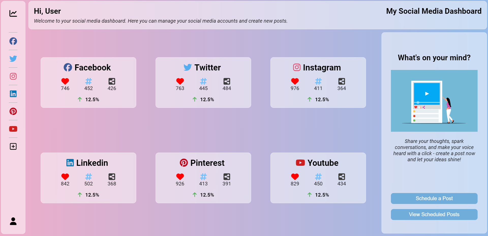
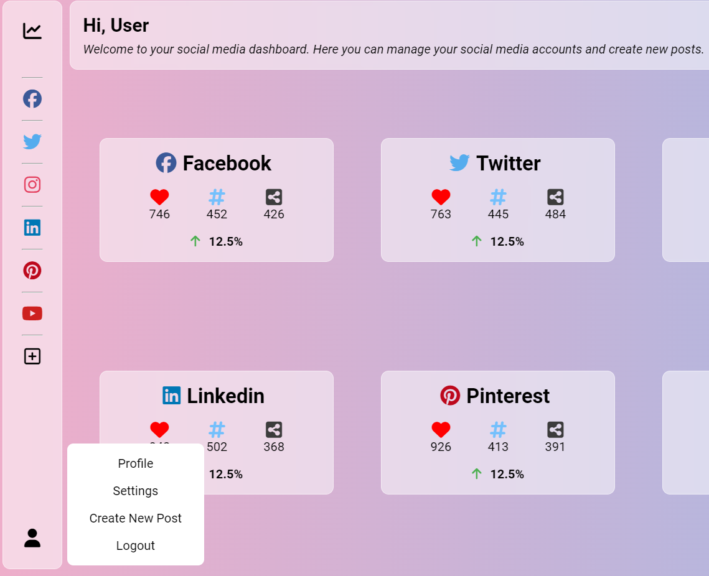
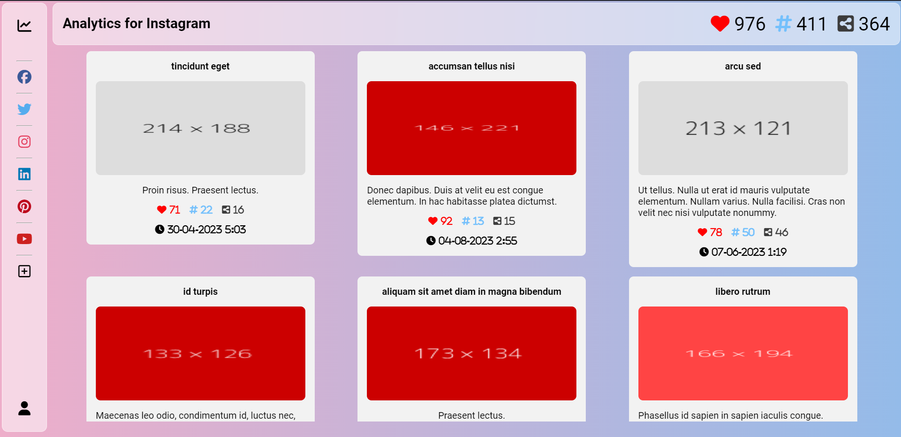
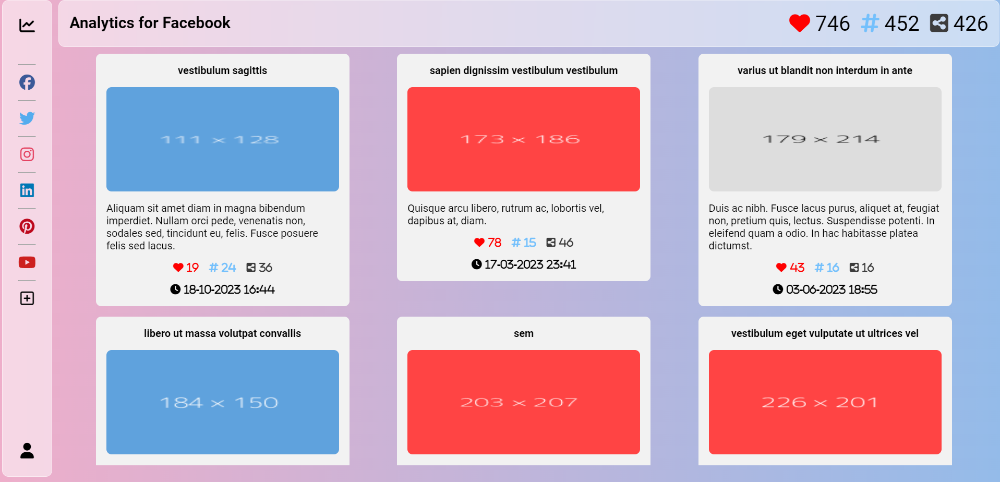
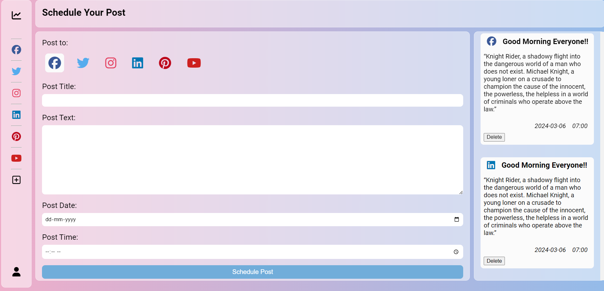

# My Social Media Dashboard



__Project Goal:__

This project is a social media dashboard that allows users to view their social media analytics in one place. The dashboard will display the user's social media analytics from Facebook, Twitter, and Instagram, and other social media platforms.
This is a one-stop-platform for users to view their social media analytics at a glance.

__Project Features:__
- Users can view their Facebook, Twitter, Instagram and other social media analytics in one place.
- Users can choose to add or remove social media platforms from their dashboard.
- Users can choose to view analytics for every post, including the number of likes, comments, shares.
- Users can schedule posts for any of their social media platforms at one place.
- This web application can used by multiple users, and each user can view their own social media analytics.
- This web application is mobile responsive.

__Project Technologies:__
- Frontend: HTML, CSS, Vanilla JavaScript
- Backend: Django, Python, SQLite
- Authentication: Django Authentication
- Social Media APIs: Mock-data for now, but will be integrated with real social media APIs in the future.
- Version Control: Git, GitHub

__Project Status:__
- The social media APIs are yet to be integrated.
- The web application is mobile responsive.
- The web application is currently using mock data for social media analytics.
- The web application is currently using Django authentication for user authentication.

__Project Screenshots:__






__Project Installation:__

1. Clone the repository.
2. Make sure you have Python 3.6 or higher installed on your machine.
3. All the dependencies are installed in the virtual environment. Run the following command to activate the virtual environment:
```bash
source venv/Scripts/activate
```

4. Run the following command to start the server:
```bash
python manage.py runserver
```
5. Open the web application in your browser using the following URL:
```bash
http://localhost:8000
```

__How to Use:__

1. Create an account using the signup page.
2. Login using your credentials.
3. Add your social media platforms to your dashboard.
4. View your social media analytics in one place.
5. Schedule posts for your social media platforms.

__Project Assumptions:__

- The web application is currently using mock data for social media analytics.
- Scheduling post comprises of only text posts for now.
- Only Limited social media platforms are available for now.
- The number of likes, comments, and shares are less than 1000 in total for now.
- The percentage increase or decrease in the number of likes, comments, and shares is just for demonstration purposes.

__Challenges I faced while making this Project:__

- I was not confident aobut Python Language, so I had to learn it for this project.
- I was not previously familiar with Django, so I had to learn it from scratch.
- So, things in Django like, Models, Views, Templates, and Authentication were challenging for me, but I was able to learn them.
- The UI of the website also took a lot of time, but I was able to overcome all the difficulties.


__What I learned from this Project:__

- I learned Python and Django from scratch.
- I learned how to use Django Authentication.
- I learned how to use Django Models, Views, and Templates.
- I learned how to use Django Admin Panel.
- I learned to use Glassmorphism UI Design.
- I learned to use CSS Grid and Flexbox for responsive design.


__External Resources Used:__

- [Django Documentation](https://docs.djangoproject.com/en/3.2/)
- [MDN Web Docs](https://developer.mozilla.org/en-US/)
- [W3Schools](https://www.w3schools.com/)
- [Stack Overflow](https://stackoverflow.com/)
- [Glassmorphism UI Design](https://democoding.in/css-glassmorphism-generator)
- [Mock Data (Mockaroo)](https://mockaroo.com/)
- [Font Awesome (Icons)](https://fontawesome.com/)
- [Google Fonts](https://fonts.google.com/)
- [Lorem Picsum (Images)](https://picsum.photos/)
- [Grid Layout Generator](https://grid.layoutit.com/)


 
__Project Author:__

> Divyam Kumar Pandey <br>
 [GitHub](https://github.com/Divyam-Kumar-Pandey) 
 [LinkedIn](https://www.linkedin.com/in/divyam-kumar-pandey/)


